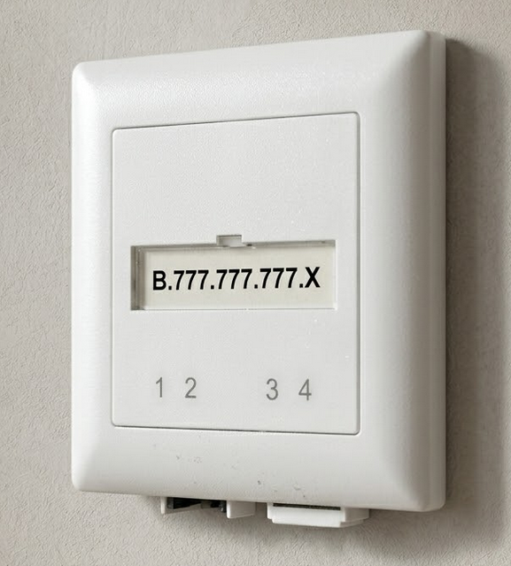

You may have heard about [25 Gbit symmetrical internet](https://www.init7.net/de/internet/fiber7/) in Switzerland. This is often cited as the fastest dedicated (non-shared) residential connection in the world. However, did you ever wonder why Switzerland has such fast internet at a reasonable price while the United States and other countries like Switzerland's neighbor Germany are falling behind?

<!--more-->

What is the fundamental difference between the countries that leads to such a stark difference in internet speeds and prices?

Free markets, regulation, technology, or all three?

Let's take a closer look at the situation in Switzerland, Germany, and the United States.


This article is written by me and spell checked with AI. Many of the images are generated by AI. They are mostly to explain certain points and break up the wall of text.


This Article is also available as a video (My first):



---

## The Paradox

As mentioned, in Switzerland, you can get [25 Gigabit per second fiber internet](https://www.init7.net/de/internet/fiber7/) to your home, symmetric and dedicated. If you don't need such extreme speed, you can get 1 or 10 Gigabit from multiple competing providers for very little money. All over a connection that isn't shared with your neighbors. In fact, someone could offer 100 Gigabit or more today; there is nothing preventing this other than the cost of endpoint equipment.

In the United States, if you're lucky enough to have fiber, you might get 1 Gigabit. But often it's shared with your neighbors. And you usually have exactly one choice of provider. Maybe two, if you count the cable company that offers slower speeds for the same price.

In Germany, you are in a somewhat similar situation to the United States. Fiber service is limited to one provider and is often shared with your neighbors.

The United States prides itself on free markets. On competition. On letting businesses fight it out. A deregulated market with no brakes.

Germany, on the other hand, is famous for over-regulation, making it difficult for businesses to operate, yet it is in a similar situation to the United States.

Switzerland has a highly regulated telecom sector with strong oversight and government-backed infrastructure projects, but regulations in Switzerland differ from those in Germany.

So why is the country that worships free markets producing stagnation, monopolies, and inferior internet, while the country with heavy regulation is producing hyper-competition, world-leading speeds, and consumer choice?

And at the same time, the country with the most regulation is suffering the same problems as the country with the least.

The answer reveals a fundamental truth about capitalism and regulation that most people get wrong.

---

## The Natural Monopoly

To understand the failure, you have to understand what economists call a "natural monopoly."

A natural monopoly is an industry where the cost of building the infrastructure is so high, and the cost of serving an additional customer is so low, that competition actually destroys value.

Think about water pipes. It would be insane to have three different water companies each digging up your street to lay their own pipes. You'd have three times the construction, three times the disruption, three times the cost. And at the end of it, you'd still only use one of them.

The rational solution is to build the infrastructure once, as a shared, neutral asset, and let different companies compete to provide the service over that infrastructure.

That's how water works. That's how electricity works in most places. And in Switzerland, that's how fiber optic internet works.

But in the United States and Germany, they did the opposite.

---

## The German Model

In Germany, the "free market" approach meant letting any company dig up the street to lay their own fiber. The result is called "overbuild." Multiple networks running in parallel trenches, often just meters apart.

Billions of euros spent on redundant concrete and asphalt. Money that could have been spent on faster equipment, lower prices, or connecting rural areas, instead wasted on digging the same hole twice, literally.[^1]

But isn't Germany heavily regulated? Yes, but the regulations focus heavily on infrastructure competition rather than duct sharing enforcement. 

Germany champions infrastructure competition, meaning it prefers multiple companies laying their own cables rather than sharing a single network. At the same time, the regulatory system wastes enormous amounts of time on waiting for digging permits and on courtroom battles just to obtain basic information about existing ducts.

Germany also has a large incumbent, Deutsche Telekom, which uses existing regulations to its competitive advantage against smaller ISPs. While Germany does have laws requiring Deutsche Telekom to share its ducts with competitors, in practice smaller ISPs face unreasonable hurdles such as high fees, procedural delays, and legal double burdens that undermine effective access.

Sharing ducts is not as bad as digging two trenches but it is still a waste of resources.

---

## The American Model

The United States took a different path, but the result is equally bad. Instead of overbuild, they got territorial monopolies, in some places paid for by the federal government.

In most American cities, you don't have a choice of fiber providers. You have whatever incumbent happens to serve your neighborhood. Comcast has one area. Spectrum has another. AT&T has a third.

This is marketed as competition. But it's not. It's a cartel. Each company gets its own protected territory, and consumers get no choice. If you don't like your provider, your only alternative is often DSL from the 1990s or a cellular hotspot.

This is what happens when you let natural monopolies operate without oversight. They don't compete on price or quality. They extract rent.

And because these networks are built on the cheap using P2MP, or shared architecture, your "gigabit" connection is shared with your entire neighborhood. At 8 PM, when everyone streams Netflix, that gigabit becomes 200 megabits. Or 100. Or less.

The provider still charges you for "gigabit." They just don't tell you that you're sharing it with 31 other households.

And it gets worse. In the United States, even if a competitor wanted to challenge the incumbent, they often can't. Because the Point of Presence, the central hub where all the fiber lines from homes converge, is private. It belongs to Comcast or AT&T. Your fiber terminates in their building. A competitor can't just install equipment there. They would have to build their own network from scratch, digging up the same streets, to reach you.

---

## The Swiss Model

Now look at Switzerland. Here, the physical infrastructure, the fiber in the ground, is treated as a neutral, shared asset. It's built once, often by a public or semi-public entity.

Every home gets a dedicated 4-strand fiber line. Point-to-Point. Not shared. Not split 32 ways.

That dedicated fiber terminates in a neutral, open hub. And *any* internet service provider can connect to that hub.

[Init7](https://www.init7.net/en/internet/fiber7/), [Swisscom](https://www.swisscom.ch), [Salt](https://www.salt.ch), or a tiny local ISP, they all have equal access to the physical line that goes into your home.[^2]

This means you, the consumer, have genuine choice. When you sign up with a provider, you simply give them your OTO (Optical Termination Outlet) number, the unique identifier printed on the fiber optic plate in your home. It tells the provider exactly which fiber connection is yours. That's it. No technician needs to visit. No one needs to dig up your street. You just call, give them the number, and within days (not always the case...), your new service is active.

And because your home has four separate fiber strands, you're not locked into a single provider. You can have [Init7](https://www.init7.net/en/internet/fiber7/) on one strand, Swisscom on another, and a local utility on a third. You can switch providers with a phone call. You can try a new provider without canceling your old one first. The competition happens on price, speed, and customer service but not on who happens to own the cable in front of your house.

---

## The Results

In Switzerland, you can get 25 Gigabit per second fiber to your home. Today. Symmetric. Dedicated. Not shared with your neighbors.

In Switzerland, you have a choice of a dozen or more providers in most cities. Prices are competitive. Customer service matters because you can leave at any time.

In the United States, the majority of households have only one choice for high-speed internet. Speeds are lower. Prices are higher. And the technology is often a decade behind.

The "free market" promised innovation. It delivered rent-seeking. The incumbents have no incentive to upgrade because you have nowhere else to go.

American broadband prices have risen faster than inflation for decades. Speeds have increased only when a competitor, usually a municipal utility, forces the incumbent to respond.

Without competition, there is no innovation. There is only profit extraction.

---

## The Oversight

Switzerland didn't arrive at this model by accident nor did it happen because telecom companies were feeling generous. It happened because regulators forced it to happen.

Back in 2008, when the industry sat down at the Round Table organized by the Federal Communications Commission, it was Swisscom, the incumbent itself, that pushed for the four-fiber Point-to-Point model. The company argued that a single fiber would create a monopoly and that regulation would be necessary.[^4]

So the standard was set. Four fibers per home. Point-to-Point. Open access for competitors on Layer 1 - the physical fiber itself.[^3]

Then, in 2020, Swisscom changed course. The company announced a new network expansion strategy, this time using P2MP, the shared model with splitters. On paper, they argued it was cheaper and faster to deploy.

[GEPON P2MP Splitter](https://www.galaxus.ch/de/s1/product/planet-gepon-splitter-1x8-plc-splitt-zubehoer-netzwerk-24666302)

But the effect was clear. Under the P2MP design, competitors would no longer have direct access to the physical fiber. Instead of plugging into their own dedicated fiber strand, they would have to rent access from Swisscom at a higher network layer - effectively becoming resellers of Swisscom's infrastructure. The open, competitive matrix that had been carefully built over years would disappear.

The small ISP Init7 filed a complaint with Switzerland's competition authority, COMCO, which later opened an investigation. In December 2020, they issued a precautionary measure: Swisscom could not continue its P2MP rollout unless it guaranteed the same Layer 1 access that the original standard provided.[^5]

Swisscom fought this all the way to the Federal Court. They lost. In 2021, the Federal Administrative Court confirmed COMCO's measures, stating that Swisscom had failed to demonstrate "sufficient technological or economic grounds" to deviate from the established fiber standard.[^5] In April 2024, COMCO finalized its ruling, fining Swisscom 18 million francs for violating antitrust law.[^6]


Swisscom is 51% owned by the Swiss Confederation. So, in simple terms, 51% state-owned and 49% privately/institutionally owned. Whether this makes the fine "symbolic" is a matter of opinion.


The result? Swisscom was forced to return to the four-fiber, Point-to-Point architecture it had originally championed.[^4] Competitors retained their direct, physical access to the fiber network. The walled garden was prevented.

Whether intended or not, the effect of Swisscom's P2MP shift was clear: competitors would have been locked out of the physical infrastructure.

Swisscom is a bit of a walking contradiction. Being majority state-owned, it's supposed to be a public service. But it's also a private company, and maximizing profit benefits the state coffers. But that is something for another blog post.

---

## The Answer

This is the paradox that confuses so many people.

The American and German approach of letting incumbents build monopolies, allowing wasteful overbuild, and refusing to regulate natural monopolies is often called a 'free market.'

But it's not free. And it's not a market.

True capitalism requires competition. But infrastructure is a natural monopoly. If you treat it like a regular consumer product, you don't get competition. You get waste, or you get a monopoly.

The Swiss model understands this. They built the infrastructure once, as a shared, neutral asset, and then let the market compete on the services that run over it.

That's not anti-capitalist. It's actually better capitalism. It directs competition to where it adds value, not to where it destroys it.

The free market doesn't mean letting powerful incumbents do whatever they want. It means creating the conditions where genuine competition can thrive.

---

## What Can Be Done

So what can other countries learn from Switzerland? Here are the key policy changes that would help:

1. **Mandate open access to physical infrastructure** - require incumbents to share fiber ducts and dark fiber with competitors at cost-based prices. This is not "socialism" - it is how electricity and water work.

2. **Enforce Point-to-Point architecture** - require that every home gets dedicated fiber strands, not shared splitters. This ensures competitors can access the physical layer, not just resell bandwidth.

3. **Create a neutral fiber standard** - establish national standards that require multi-fiber deployment to every home, as Switzerland did in 2008.

4. **Empower competition authorities** - give regulators like COMCO real teeth to enforce these rules. Fines must be large enough to matter.

5. **Support municipal fiber** - allow cities and towns to build their own fiber networks when incumbents fail to serve residents adequately.

If you care about faster internet and lower prices, push your representatives to support these policies. The technology exists. The money exists. What is missing is the political will to demand real competition.

## Sources

[^1]: Bundesnetzagentur: *Bun­desnet­za­gen­tur pub­lish­es fi­nal re­port on the mon­i­tor­ing of du­pli­cate fi­bre infrastructure projects*  (July 2025) - https://www.bundesnetzagentur.de/SharedDocs/Pressemitteilungen/EN/2025/20250730_Doppelausbau.html

[^2]: Init7: *Fiber7 PoPs - Business Infrastructure* - https://www.init7.net/de/business-infrastruktur/fiber7-pops/

[^3]: Swissinfo.ch: *Fibre-optic standards simplify networking* (January 2013) - https://www.swissinfo.ch/eng/business/fibre-optic-standards-simplify-networking/31974894

[^4]: Computerworld.ch: *Swisscom krebst zurueck* (February 2023) - https://www.computerworld.ch/themen/technologie-und-innovation/swisscom-krebst-zurueck

[^5]: Federal Administrative Court (BVGer) media release: *Swisscom must comply with fibre-optic standards* (December 2021) - https://www.bvger.ch/en/newsroom/media-releases/swisscom-must-comply-with-fibre-optic-standards-1063

[^6]: COMCO (Swiss Competition Commission): *Swisscom fine for violating fibre-optic standards* (April 2024) - https://www.swissinfo.ch/eng/science/comco-gives-swisscom-2025-deadline-in-fibre-optic-dispute/76393735

